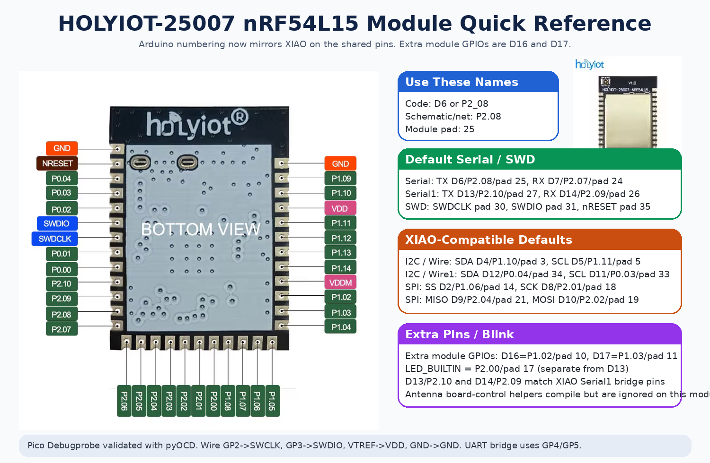

# nRF54 Arduino Core

Open-source Arduino board package for **nRF54L15 boards** with a secure
single-image, register-level implementation.

- Board package: `nRF54L15 Boards`
- Supported boards:
  - `XIAO nRF54L15 / Sense`
  - `HOLYIOT-25008 nRF54L15 Module`
  - `HOLYIOT-25007 nRF54L15 Module`
  - `Generic nRF54L15 Module (36-pad)`
- Runtime model: no Zephyr runtime, no nRF Connect SDK runtime
- Default build mode: secure single image

## What This Repo Provides

This repo ships two things:

1. A normal Arduino Boards Manager package for the supported `nRF54L15` boards.
2. A bundled register-level HAL/BLE library used by the board core and exposed to sketches.

Current scope:

- GPIO, clock, SPI, I2C, UART, ADC, TIMER, PWM, GPIOTE, TEMP, WDT, PDM
- DPPI/EGU helpers plus usable KMU and TAMPC security wrappers
- Raw `NRF_RADIO` and `NRF_I2S` register access for low-level library ports
- `RawRadioLink` helper for proprietary 1 Mbit packet TX/RX on `RADIO`
- POWER / RESET / REGULATORS / GRTC control
- BLE legacy and extended advertising, active/passive scan, stable connected-link scheduling, ATT/GATT peripheral and client flows, Nordic UART Service transport, and Bluefruit/Seeed-style wrapper support
- Zigbee HA coordinator / light / sensor examples plus lower-level 802.15.4 bring-up helpers
- reusable VPR shared-transport/controller-service groundwork plus a dedicated
  VPR-backed CS transport image
- channel-sounding bring-up hooks, phase-ranging examples, raw DFE helpers, and
  controller-style CS parsing/host layers
- Low-power `WFI` and true `SYSTEM OFF` paths on XIAO

## Install

Boards Manager URL for current releases:

```text
https://raw.githubusercontent.com/lolren/nrf54-arduino-core/main/package_nrf54l15clean_index.json
```

Archive URL for older releases:

```text
https://raw.githubusercontent.com/lolren/nrf54-arduino-core/main/package_nrf54l15clean_archive_index.json
```

Install `nRF54L15 Boards`, then select one of:

- `XIAO nRF54L15 / Sense`
- `HOLYIOT-25008 nRF54L15 Module`
- `HOLYIOT-25007 nRF54L15 Module`
- `Generic nRF54L15 Module (36-pad)`

Default upload methods:

- `XIAO nRF54L15 / Sense`: `Auto Recover (Default)`
- `HOLYIOT-25008 nRF54L15 Module`: `pyOCD (CMSIS-DAP, Default)`
- `HOLYIOT-25007 nRF54L15 Module`: `pyOCD (CMSIS-DAP, Default)`
- `Generic nRF54L15 Module (36-pad)`: `pyOCD (CMSIS-DAP, Default)`

What is automatic now:

- Boards Manager installs the compiler, OpenOCD, and the small `nrf54l15hosttools` helper package
- normal compile no longer needs a build-time Python hook
- the bundled host-tools package now carries offline `pyOCD` wheelhouses for
  common host Python versions, so the recovery uploader no longer has to hit
  the network on the normal `3.10` / `3.11` / `3.12` path

What is still host-specific:

- Linux `udev` access for the CMSIS-DAP probe
- the recovery-capable default upload path still uses the Python helper so it can handle protected-target and unlock cases reliably
- direct OpenOCD upload is exposed as an explicit experimental option, not the default, because the shipped OpenOCD target config still is not strong enough to replace the helper path completely
- if the local Python is outside the bundled wheelhouse set, the helper falls
  back to the normal online `pip` install path instead of failing outright

Fresh-machine recovery/setup helpers:

- Linux: run `tools/setup/install_linux_host_deps.sh --udev` from the installed `nrf54l15hosttools` package, or the matching script in the repo
- Windows: run `tools\\setup\\install_windows_host_deps.ps1` from the installed `nrf54l15hosttools` package, or the matching script in the repo

The main package index now stays intentionally lean and only keeps recent
releases. Full version history stays in the archive index instead of bloating
the default install path.

CLI:

```bash
arduino-cli core update-index \
  --additional-urls https://raw.githubusercontent.com/lolren/nrf54-arduino-core/main/package_nrf54l15clean_index.json

arduino-cli core install nrf54l15clean:nrf54l15clean \
  --additional-urls https://raw.githubusercontent.com/lolren/nrf54-arduino-core/main/package_nrf54l15clean_index.json
```

## Supported Boards

| Board | FQBN | Default upload | Notes |
|---|---|---|---|
| `XIAO nRF54L15 / Sense` | `nrf54l15clean:nrf54l15clean:xiao_nrf54l15` | `Auto Recover` | Full onboard rail and antenna helpers. |
| `HOLYIOT-25008 nRF54L15 Module` | `nrf54l15clean:nrf54l15clean:holyiot_25008_nrf54l15` | `pyOCD (CMSIS-DAP)` | Dedicated board target with onboard RGB LED, button, LIS2DH12, and `D0/D1` serial-pad GPIO menu. |
| `HOLYIOT-25007 nRF54L15 Module` | `nrf54l15clean:nrf54l15clean:holyiot_25007_nrf54l15` | `pyOCD (CMSIS-DAP)` | Named module target with documented 36-pad pinout. |
| `Generic nRF54L15 Module (36-pad)` | `nrf54l15clean:nrf54l15clean:generic_nrf54l15_module_36pin` | `pyOCD (CMSIS-DAP)` | Same 36-pad variant without vendor branding. |

### XIAO nRF54L15 / Sense

This is still the most fully integrated board target in the repo.

- onboard rail helpers are implemented for battery sense, IMU/mic power, and RF switch control
- antenna-path helpers are real on this board
- low-power examples and board-policy behavior are primarily validated here
- default upload path stays `Auto Recover`


Quick reference:

- `D0-D5`: main header GPIO/ADC set and the real hardware PWM pins
- `D6-D7`: header UART pins when `Serial` is routed to the header
- `D8-D10`: default SPI
- `D11-D12`: back-pad `Wire1`
- `LED_BUILTIN`: onboard user LED
- `PIN_BUTTON`: onboard button

Full board reference:

- [XIAO nRF54L15 / Sense Reference](docs/board-reference.md)

### HOLYIOT-25008

The `HOLYIOT-25008 nRF54L15 Module` now has its own dedicated board target
instead of living behind the generic module variant.

<p>
  
</p>


Board-specific aliases:

- `LED_BUILTIN` / `LED_GREEN` -> onboard green LED on `P1.10/D4`
- `LED_RED` -> onboard red LED on `P2.09/D14`
- `LED_BLUE` -> onboard blue LED on `P2.07/D7`
- `PIN_BUTTON` -> onboard button on `P1.13/A6`
- `PIN_LIS2DH12_*` -> onboard accelerometer SPI/INT pins

Board-specific tools menu behavior:

- `Serial Routing -> Header UART on D0/D1 (Default)`
- `Serial Routing -> GPIO on D0/D1 (Serial disabled)`

External programmer note:

- validated with Raspberry Pi Debugprobe on Pico through `pyOCD / CMSIS-DAP`
- upstream project: <https://github.com/raspberrypi/debugprobe>

Dedicated onboard examples appear in:

- `HOLYIOT-25008 Board Examples -> Holyiot25008RgbButton`
- `HOLYIOT-25008 Board Examples -> Holyiot25008Lis2dh12Spi`
- `HOLYIOT-25008 Board Examples -> Holyiot25008UartPadsAsGpio`

Legacy copies also remain in:

- `Boards -> Holyiot25008RgbButton`
- `Boards -> Holyiot25008Lis2dh12Spi`
- `Boards -> Holyiot25008UartPadsAsGpio`
- `Nrf54L15-Clean-Implementation -> Board -> Holyiot25008RgbButton`
- `Nrf54L15-Clean-Implementation -> Board -> Holyiot25008Lis2dh12Spi`

Full board reference:

- [HOLYIOT-25008 Module Reference](docs/holyiot-25008-module-reference.md)

### HOLYIOT-25007 / Generic 36-pad Module

The `HOLYIOT-25007 nRF54L15 Module` and `Generic nRF54L15 Module (36-pad)`
boards share the same pad map and default peripheral routes.

<p>
  
</p>




Pin naming rule for the module boards:

- use `P2_08` / `P1_10` when you want the real MCU GPIO names in code or hardware notes
- use `D6` / `D4` when you want Arduino aliases
- use physical pad numbers like `25` only for soldering and rework

Default module routes:

- `Serial`: `TX=D6/P2.08/pad 25`, `RX=D7/P2.07/pad 24`
- `Serial1`: same default pins as `Serial`
- `Wire`: `SDA=D4/P1.10/pad 3`, `SCL=D5/P1.11/pad 5`
- `Wire1`: `SDA=D12/P0.04/pad 34`, `SCL=D11/P0.03/pad 33`
- `SPI`: `SS=D2/P1.06/pad 14`, `SCK=D8/P2.01/pad 18`,
  `MISO=D9/P2.04/pad 21`, `MOSI=D10/P2.02/pad 19`
- `LED_BUILTIN`: `P2.00/pad 17` as a separate compatibility LED pin, not `D13`

Important module note:

- `LED_BUILTIN` is a default Blink/demo pad on the bare module variants, not a guaranteed onboard LED
- Raspberry Pi Debugprobe on Pico is validated on the module boards with `pyOCD`
- XIAO board-control helpers still compile on the module variants; antenna
  selection helpers remain harmless no-ops, while RF-path power ownership is
  emulated in software so BLE/Zigbee bring-up still works on the fixed module
  antenna path

Full module reference:

- [HOLYIOT-25007 Module Reference](docs/holyiot-25007-module-reference.md)

## Board Peripheral Status

The board-level Arduino peripheral story is in usable shape now. The core is no
longer just a wireless bring-up experiment.

Working and exercised in shipped examples:

- GPIO, interrupts, and GPIOTE-based event handling
- `Serial` / UART, including runtime pin remap paths
- SPI master
- I2C controller, repeated-start flows, and basic target/responder examples
- ADC, VBAT sampling, and on-chip temperature reads
- hardware PWM plus the software/timer-backed fallback paths used on the XIAO
  pinout
- TIMER, watchdog, clock, reset, regulators, and GRTC-backed wake/sleep paths
- PDM and I2S low-level bring-up helpers
- EGU event generation, KMU metadata/status probing, TAMPC status/control probing,
  and a broader TAMPC advanced-configuration probe
- KMU -> CRACEN IKG seed proof, a generic VPR shared-transport probe, a
  reusable VPR controller-service host wrapper, non-CS VPR offload proofs for
  `FNV1a`, `CRC32`, `CRC32C`, an autonomous ticker service, queued VPR async
  event handling, hibernate saved-context probes, reset-after-hibernate service
  restart probes, and a runtime serial-fabric probe for the extra `22` / `30`
  instance paths
- board-control helpers for RF switch, antenna path, battery sampling, and
  other XIAO-specific rails/pins

What still needs more work:

- broader third-party library compatibility on top of the core peripherals
- more “finished product” examples around less-common blocks like I2S and PDM
- more measured documentation around edge cases, especially low-power
  combinations and mixed peripheral use
- broader external-tamper and reset-cause characterization for TAMPC is still
  ahead of the current config/runtime probes
- richer VPR-side runtime depth still needs more work before calling that path
  production-ready, and true raw VPR CPU-context resume is still intentionally
  treated as an investigation topic instead of a public lifecycle feature

## VPR Status

The VPR path is now beyond a one-off bring-up experiment. There is a reusable
shared-memory transport, a host-side controller-service wrapper, a generic VPR
service image for non-CS work, and a dedicated CS-focused VPR image for the
channel-sounding path.

Working and validated:

- shared-memory boot/control path on the XIAO nRF54L15 target
- reusable `VprSharedTransportStream` and `VprControllerServiceHost` wrappers
- built-in generic VPR service currently reporting `svc=1.10` /
  `opmask=0x3FFFF`
- validated non-CS offload/service probes:
  `VprSharedTransportProbe`, `VprFnv1aOffloadProbe`,
  `VprCrc32OffloadProbe`, `VprCrc32cOffloadProbe`,
  `VprTickerOffloadProbe`, `VprTickerAsyncEventProbe`,
  `VprBleLegacyAdvertisingProbe`, `VprBleConnectionStateProbe`,
  `VprHibernateContextProbe`, `VprHibernateWakeProbe`,
  `VprHibernateResumeProbe`, and `VprRestartLifecycleProbe`
- the VPR probe family now also appears directly in the normal
  `File -> Examples -> Nrf54L15-Clean-Implementation -> VPR` library menu
  instead of only in the board-package `Peripherals` examples
- first broader BLE-controller-facing generic service slices now exist:
  a VPR-owned legacy non-connectable advertising scheduler, retained adv-data
  storage, single-link connected-session state, shared-state link snapshot,
  and async event path exposed through `VprControllerServiceHost`
- queued unsolicited VPR ticker/vendor events on the host side instead of the
  old effectively single-depth handling
- repeated loaded-image restart validated on both attached boards through
  `VprRestartLifecycleProbe`
- deterministic reset-after-hibernate retained service restart validated on
  both attached boards through `VprHibernateResumeProbe`

What this means in practice:

- VPR can already absorb small controller/offload jobs that do not belong in
  the main sketch loop
- the main core does not need to own every timing-sensitive service path
- the current reusable lifecycle design is the reset-after-hibernate retained
  service restart, not raw VPR CPU-context resume

Still incomplete:

- a richer general-purpose VPR runtime/service beyond the current vendor-style
  probe/offload set
- real BLE controller service ownership on VPR instead of the current CS demo
  responder model
- true raw VPR CPU-context resume as a finished public feature

## BLE Status

BLE is stable enough now to be one of the main reasons to use this core.

Tested and working on real hardware:

- legacy advertising, connectable/scannable advertising, and the validated
  extended advertising/scanning examples
- the extended scanner regression from `0.2.0+` is fixed again, so
  `BleExtendedScanner` now reassembles the full `BleExtendedAdv251`,
  `BleExtendedAdv499`, and `BleExtendedAdv995` payload lengths instead of
  truncating them on the scanner side
- active and passive scanning
- Bluefruit active scanning now surfaces separate real `SCAN_RSP` reports in
  the scan callback path, including the correct `report->type.scan_response`
  bit on scan-response packets
- peripheral and central links on both nRF54<->nRF54 and nRF54<->nRF52840
  combinations
- bundled ATT/GATT examples for both 16-bit and 128-bit custom services
- native Nordic UART Service (NUS) sketches, including the bridge and loopback
  paths
- Bluefruit BLEUart / central / notify flows used for common nRF52 sketch ports

Practical status today:

- the common BLE paths are usable without rewriting the whole sketch
- the major central discovery/notify regressions from older releases are fixed
- the Bluefruit active-scan wrapper now reports ADV and SCAN_RSP packets as
  separate callback reports instead of collapsing everything into the ADV
  packet path
- the Qualcomm visibility/connectivity problem on the native NUS sketches was
  fixed in `0.3.8`
- ordinary user sketches should not have to tiptoe around BLE timing just
  because they print status over `Serial`

Still incomplete:

- not every Bluetooth LE feature in the spec is implemented
- not every upstream Bluefruit example has full runtime parity
- some optional Bluefruit examples still depend on extra third-party libraries
- channel sounding is still experimental and not finished as a user-facing BLE
  feature
- the clean-core CS path now exposes raw DFE capture, DFE switch-pattern
  controls, HCI-style subevent step parsing helpers, raw HCI subevent-result
  parsing/reassembly, controller-style step-buffer distance estimation
  helpers, transport-agnostic HCI CS command/completion packet helpers, a CS
  workflow/session/host state machine layer, H4-style HCI framing helpers for
  command/event byte streams and mixed H4 streams with interleaved ACL traffic,
  controller-standard RTT step decode and RTT distance estimation from HCI CS
  subevent results, and a working VPR-backed controller transport path with a
  dedicated CS VPR image and built-in demo responder for the supported opcode
  set; the dedicated CS image now also reflects real command-owned `Create
  Config` and `Set Procedure Parameters` state in its completion packets
  instead of only fixed demo placeholders, and it now rejects at least one
  real bad sequence (`Set Procedure Parameters` before `Security Enable`)
  instead of blindly succeeding for every CS opcode; it also now handles
  `Remove Config`, validates invalid `Create Config` / invalid procedure-parameter
  payloads with real `0x12` errors on the VPR side, and resets the active CS
  state on the VPR side; it still does not have a real production BLE
  controller runtime, so this is not yet a full controller-backed Bluetooth CS
  implementation
- broader phone/runtime coverage is still worth adding over time

## nRF52840 Sketch Compatibility

The repo bundles a `Bluefruit52Lib` compatibility layer plus a small set of
nRF52-style core shims so a large part of the XIAO nRF52840 / Seeed nRF52 /
Bluefruit sketch style now carries over to the XIAO nRF54L15.

The goal here is sketch compatibility, not a new API. For common BLE ports, the
intended path is:

- keep the same Bluefruit-style sketch structure
- reuse the familiar BLEUart / scanner / central / peripheral calls
- only adjust the sketch where it depends on an extra library or on an
  upstream feature that is still outside this core’s tested surface

The package exposes that compatibility in Arduino IDE with:

- curated `Bluefruit52Lib -> nRF52Compat` examples for direct porting
- broader Bluefruit example menus grouped by use case:
  `Advertising`, `Central`, `Diagnostics`, `DualRoles`, `HID`, `Projects`,
  `Security`, and `Services`

In practice, the compatibility layer is in good shape for the standard BLE
paths that matter most when moving sketches from XIAO nRF52840 to nRF54L15:

- BLE UART / NUS
- scanning and device discovery
- common peripheral services
- common central discovery and notify flows

Remaining compile misses are generally optional third-party library
dependencies, not the wrapper itself.

## Zigbee Status

Zigbee is no longer just local two-board bring-up. It now has a validated Home
Assistant / Zigbee2MQTT path for the shipped HA light examples.

Working and tested:

- two-board local coordinator / joinable device flows on XIAO nRF54L15 boards
- Home Assistant / Zigbee2MQTT join, interview, and on/off control on the
  validated HA light path
- Home Assistant / Zigbee2MQTT sleepy end-device interview on the new low-power
  button path
- retained network state and secure rejoin on the shipped HA examples
- coordinator, router, end-device, light, sensor, and low-power example groups
- sleepy-device style examples that wake, report battery/status, poll, and go
  back to sleep

What still needs work:

- this is not full Zigbee 3.0 device/cluster coverage yet
- RGB / color-light clusters are still missing
- more coordinator combinations should be exercised beyond the validated path
- richer Zigbee2MQTT / Home Assistant device typing for some generated devices,
  especially sleepy remotes
- more sensor/device personalities can still be added
- battery-tuned sleepy devices still need more real current characterization

## Low Power Status

Low-power support is usable and already feeds into the Zigbee sleepy-device
examples.

Working:

- `WFI` idle paths
- true `SYSTEM OFF` examples with wake sources
- low-power BLE advertiser patterns
- Zigbee sleepy-device examples with configurable wake/report intervals
- low-power Zigbee button and sensor examples that use the XIAO button for
  pairing / action wake flows

Still to do:

- broaden the published current-draw tables
- measure more full-system scenarios instead of only focused low-power probes
- keep tightening the interaction between low power and long-running wireless
  roles

## Future Wireless Work

The main wireless gaps now are feature-completeness gaps, not “does the radio
basically work” gaps.

Not finished yet:

- user-facing channel sounding support; the current work is still partial and
  experimental
- Thread; it has not been implemented in this repo yet
- Matter; it has not been started here yet and should follow real Thread/VPR
  controller groundwork rather than being layered on top of the current
  partial wireless stack
- richer Zigbee HA device coverage, especially color-light style devices
- broader automated BLE phone/interoperability coverage

## Examples

### Board Examples

Board examples live under [`hardware/nrf54l15clean/nrf54l15clean/examples`](hardware/nrf54l15clean/nrf54l15clean/examples).
This menu is intentionally curated for board/core-specific sketches that are not already covered better by the implementation library.
Most peripheral, BLE, and Zigbee demos now live under the library example menu instead of the board menu.

In Arduino IDE they should appear under:

- `File -> Examples -> Examples for XIAO nRF54L15 / Sense -> Basics`
- `... -> Peripherals`
- `... -> Power`

Suggested starting points:

- Basics: [`CoreVersionProbe`](hardware/nrf54l15clean/nrf54l15clean/examples/Basics/CoreVersionProbe)
- Peripherals: [`RuntimePeripheralPinRemap`](hardware/nrf54l15clean/nrf54l15clean/examples/Peripherals/RuntimePeripheralPinRemap), [`WireImuRemapScanner`](hardware/nrf54l15clean/nrf54l15clean/examples/Peripherals/WireImuRemapScanner), [`XiaoBoardControlPins`](hardware/nrf54l15clean/nrf54l15clean/examples/Peripherals/XiaoBoardControlPins), [`VbatReadViaAnalogRead`](hardware/nrf54l15clean/nrf54l15clean/examples/Peripherals/VbatReadViaAnalogRead), [`WireRepeatedStartProbe`](hardware/nrf54l15clean/nrf54l15clean/examples/Peripherals/WireRepeatedStartProbe), [`WireTargetResponder`](hardware/nrf54l15clean/nrf54l15clean/examples/Peripherals/WireTargetResponder), [`InterruptPwmApiProbe`](hardware/nrf54l15clean/nrf54l15clean/examples/Peripherals/InterruptPwmApiProbe), [`PeripheralProbe`](hardware/nrf54l15clean/nrf54l15clean/examples/Peripherals/PeripheralProbe), [`EguTriggerDemo`](hardware/nrf54l15clean/nrf54l15clean/examples/Peripherals/EguTriggerDemo), [`KmuMetadataProbe`](hardware/nrf54l15clean/nrf54l15clean/examples/Peripherals/KmuMetadataProbe), [`KmuCracenIkgSeedProof`](hardware/nrf54l15clean/nrf54l15clean/examples/Peripherals/KmuCracenIkgSeedProof), [`TampcStatusReporter`](hardware/nrf54l15clean/nrf54l15clean/examples/Peripherals/TampcStatusReporter), [`TampcAdvancedConfigProbe`](hardware/nrf54l15clean/nrf54l15clean/examples/Peripherals/TampcAdvancedConfigProbe), [`SerialFabricExtraInstanceProbe`](hardware/nrf54l15clean/nrf54l15clean/examples/Peripherals/SerialFabricExtraInstanceProbe), [`SerialFabricRuntimeProbe`](hardware/nrf54l15clean/nrf54l15clean/examples/Peripherals/SerialFabricRuntimeProbe), [`VprSharedTransportProbe`](hardware/nrf54l15clean/nrf54l15clean/examples/Peripherals/VprSharedTransportProbe), [`VprFnv1aOffloadProbe`](hardware/nrf54l15clean/nrf54l15clean/examples/Peripherals/VprFnv1aOffloadProbe), [`VprCrc32OffloadProbe`](hardware/nrf54l15clean/nrf54l15clean/examples/Peripherals/VprCrc32OffloadProbe), [`VprCrc32cOffloadProbe`](hardware/nrf54l15clean/nrf54l15clean/examples/Peripherals/VprCrc32cOffloadProbe), [`VprTickerOffloadProbe`](hardware/nrf54l15clean/nrf54l15clean/examples/Peripherals/VprTickerOffloadProbe), [`VprTickerAsyncEventProbe`](hardware/nrf54l15clean/nrf54l15clean/examples/Peripherals/VprTickerAsyncEventProbe), [`VprBleLegacyAdvertisingProbe`](hardware/nrf54l15clean/nrf54l15clean/libraries/Nrf54L15-Clean-Implementation/examples/VPR/VprBleLegacyAdvertisingProbe), [`VprBleConnectionStateProbe`](hardware/nrf54l15clean/nrf54l15clean/libraries/Nrf54L15-Clean-Implementation/examples/VPR/VprBleConnectionStateProbe), [`VprHibernateContextProbe`](hardware/nrf54l15clean/nrf54l15clean/examples/Peripherals/VprHibernateContextProbe), [`VprHibernateWakeProbe`](hardware/nrf54l15clean/nrf54l15clean/examples/Peripherals/VprHibernateWakeProbe), [`VprHibernateResumeProbe`](hardware/nrf54l15clean/nrf54l15clean/examples/Peripherals/VprHibernateResumeProbe), [`VprRestartLifecycleProbe`](hardware/nrf54l15clean/nrf54l15clean/examples/Peripherals/VprRestartLifecycleProbe)
- Power: [`DelayAutoLowPowerMeasure`](hardware/nrf54l15clean/nrf54l15clean/examples/Power/DelayAutoLowPowerMeasure), [`SystemOffWakeDiag`](hardware/nrf54l15clean/nrf54l15clean/examples/Power/SystemOffWakeDiag), [`SystemOffWakeOnceDiag`](hardware/nrf54l15clean/nrf54l15clean/examples/Power/SystemOffWakeOnceDiag)

Bundled library examples for `EEPROM`, `Preferences`, `Nrf54L15-Clean-Implementation`, and `Bluefruit52Lib` appear in their own library menus.

For deeper Zigbee details, use the checked-in docs instead of relying on the
README as a changelog:

- [Zigbee Feature Matrix](docs/ZIGBEE_FEATURE_MATRIX.md)
- [Zigbee 3.0 Parity Plan](docs/ZIGBEE_3P0_PARITY_PLAN.md)
- [Zigbee External Coordinator Flow](docs/ZIGBEE_EXTERNAL_COORDINATOR_FLOW.md)

### Library Examples

The bundled HAL/BLE library examples live under [`hardware/nrf54l15clean/nrf54l15clean/libraries/Nrf54L15-Clean-Implementation/examples`](hardware/nrf54l15clean/nrf54l15clean/libraries/Nrf54L15-Clean-Implementation/examples).
The bundled Bluefruit compatibility examples live under [`hardware/nrf54l15clean/nrf54l15clean/libraries/Bluefruit52Lib/examples`](hardware/nrf54l15clean/nrf54l15clean/libraries/Bluefruit52Lib/examples).

In Arduino IDE they now appear under:

- `File -> Examples -> Nrf54L15-Clean-Implementation -> BLE`
- `File -> Examples -> Nrf54L15-Clean-Implementation -> LowPower`
- `File -> Examples -> Nrf54L15-Clean-Implementation -> Diagnostics`
- `File -> Examples -> Nrf54L15-Clean-Implementation -> Board`
- `File -> Examples -> Nrf54L15-Clean-Implementation -> Peripherals`
- `File -> Examples -> Nrf54L15-Clean-Implementation -> VPR`
- `File -> Examples -> Nrf54L15-Clean-Implementation -> Zigbee`
- `File -> Examples -> Bluefruit52Lib -> Advertising`
- `File -> Examples -> Bluefruit52Lib -> Central`
- `File -> Examples -> Bluefruit52Lib -> Diagnostics`
- `File -> Examples -> Bluefruit52Lib -> DualRoles`
- `File -> Examples -> Bluefruit52Lib -> HID`
- `File -> Examples -> Bluefruit52Lib -> nRF52Compat`
- `File -> Examples -> Bluefruit52Lib -> Peripheral`
- `File -> Examples -> Bluefruit52Lib -> Projects`
- `File -> Examples -> Bluefruit52Lib -> Security`
- `File -> Examples -> Bluefruit52Lib -> Services`

Recommended library examples:

- Low-power floor measurement: `LowPowerZephyrParityBlink` (`5 ms` pulse, meter-oriented)
- Visible timed system off check: `LowPowerDelaySystemOff`
- Idle CPU scaling: `LowPowerIdleCpuScaling`
- Continuous low-power BLE: `BleAdvertiserLowestPowerContinuous`, `BleAdvertiserRfSwitchDutyCycle`
- Burst/beacon BLE: `BleAdvertiserPhoneBeacon15s`, `BleAdvertiserHybridDutyCycle`, `BleAdvertiserBurstSystemOff`
- Zigbee: `ZigbeeCoordinator`, `ZigbeeRouter`, `ZigbeeEndDevice`, `ZigbeePingInitiator`, `ZigbeePongResponder`, `ZigbeeStackCodecSelfTest`, `ZigbeeHaCoordinatorJoinDemo`, `ZigbeeHaOnOffLightStatic`, `ZigbeeHaOnOffLightJoinable`, `ZigbeeHaDimmableLightStatic`, `ZigbeeHaDimmableLightJoinable`, `ZigbeeHaTemperatureSensorStatic`, `ZigbeeHaTemperatureSensorJoinable`
- BLE diagnostics: `BleAdvertiserProbe`, `BlePassiveScanner`, `BleActiveScanner`, `BleExtendedScanner`, `BleExtendedActiveScanner`, `BleLegacyAdv31Plus31`, `BleExtendedAdv251`, `BleExtendedScannableAdv251`, `BleExtendedAdv499`, `BleExtendedAdv995`, `BleConnectionPeripheral`, `BleGattBasicPeripheral`
- Bluefruit/nRF52 compatibility starter pack: `central_bleuart`, `central_scan`, `central_notify`, `dual_bleuart`, `beacon`, `custom_hrm`, `notify_peripheral`, `pairing_pin`
- Bluefruit wrapper categories: `Advertising` (`adv_advanced`, `beacon`, `eddystone_url`), `Central` (`central_bleuart_multi`, `central_hid`, `central_pairing`, `central_scan_advanced`), `Diagnostics` (`throughput`, `rssi_callback`, `rssi_poll`), `HID` (`blehid_keyboard`, `blehid_mouse`, `blehid_gamepad`), `Security` (`pairing_passkey`, `clearbonds`), `Services` (`bleuart`, `bleuart_multi`, `custom_hrm`, `custom_htm`, `client_cts`, `ancs`), `Projects` (`rssi_proximity_central`, `rssi_proximity_peripheral`), plus the existing `Peripheral` menu
- Peripheral bring-up: `RawI2sTxInterrupt`, `I2sTxWrapperInterrupt`, `I2sRxWrapperInterrupt`, `I2sDuplexWrapperInterrupt`, `RawRadioPacketTx`, `RawRadioPacketRx`, `RawRadioAckRequester`, `RawRadioAckResponder`
- `I2sTxWrapperInterrupt` shows the callback-based refill path, where the next buffer is generated from the I2S IRQ instead of managed manually in the sketch loop
- `I2sRxWrapperInterrupt` shows the matching receive path, where completed RX buffers are handed to a callback from the same `I2S20` IRQ service model
- `I2sDuplexWrapperInterrupt` combines both directions on one `I2S20` instance and supports a simple one-board loopback with a jumper from `D11` to `D15`

Two-board extended advertising regression:

- `scripts/ble_extended_adv_dual_board_regression.py --advertiser 995`
- `scripts/ble_extended_adv_dual_board_regression.py --advertiser 499`
- expects two XIAO nRF54L15 boards on separate `/dev/ttyACM*` ports
- auto-resolves each board's CMSIS-DAP UID from the serial port and flashes deterministically
- Host-side NUS HCI trace regression: `scripts/ble_nus_btmon_regression.py --iterations 12`
- Pure-BLE NUS loopback regression: `scripts/ble_nus_loopback_btmon_regression.py --iterations 64`
- Bring-up: `CleanBringUp`, `PeripheralSelfTest`, `FeatureParitySelfTest`

The Zigbee examples now cover more than raw radio bring-up. The practical set
for this release is:

- coordinator and joinable HA light demos for two-board work
- Zigbee2MQTT / Home Assistant join and interview on the validated light path
- retained network state and secure rejoin on the shipped HA examples
- sleepy sensor demos that wake, report, poll, and return to `SYSTEM OFF`

It is still not a full Zigbee 3.0 stack with every cluster profile or every
coordinator combination exercised. The detailed state of that work stays in the
Zigbee docs listed above.

## Power And Zephyr Parity

This core now reproduces the same **class of low-power behavior** we were chasing in Zephyr on XIAO nRF54L15.

What mattered was not only the final `SYSTEMOFF` write. The working path required:

- secure peripheral map
- Zephyr-like secure startup writes in `SystemInit()`
- oscillator trim and regulator setup parity
- correct secure-domain GRTC wake programming
- board rail shutdown before `SYSTEM OFF`
- optional RAM retention clear only for the explicit ultra-low-power paths

Practical result on the XIAO board from local validation:

- true `SYSTEM OFF` blink / burst-beacon paths: **tens of uA**
- continuous low-power BLE with RF-switch duty-cycling: about **0.1 mA**
- long-sleep phone-tuned beaconing is now available as `BleAdvertiserPhoneBeacon15s`, which keeps the payload in the primary ADV packet, avoids scan-response dependence, and spends most of its cycle in true `SYSTEM OFF`
- `delay()` / `yield()` low-power idle path: both now stay board-state-neutral
  in the normal Arduino path, so sketch-controlled rails such as `VBAT_EN`,
  `RF_SW`, and `IMU_MIC_EN` remain asserted across `delay()` in WFI mode
- `examples/Power/SenseDelayRailRetentionProbe`: samples those rail pins
  halfway through `delay(500)` from a GRTC interrupt and immediately probes
  VBAT/IMU after wake, which is useful when checking the `#43` regression on
  a Sense board without a PPK2

For the explicit XIAO save/collapse/restore helper, use `delayLowPowerIdle(ms)`.

That puts the `SYSTEM OFF` path in the same broad regime as the Zephyr result on this board.

New core-level low-power helpers:

- `delaySystemOff(ms)`: timed `SYSTEM OFF` sleep with cold-boot wake, preserving `.noinit` RAM by default
- `delaySystemOffNoRetention(ms)`: same path, but clears RAM retention for the lowest current
- `ClockControl::enableIdleCpuScaling(CpuFrequency::k64MHz)`: keep active code at the current CPU speed, but drop to 64 MHz around `delay()` / `yield()` idle windows and restore on wake

Important distinction:

- `SYSTEM OFF` parity is now real and reproducible in this core
- continuous BLE advertising is still not controller-equivalent to Zephyr, because this core manually emits raw legacy advertising events rather than running Zephyr's controller scheduler

Relevant docs:

- [Zephyr low-power parity](docs/low-power-zephyr-parity.md)
- [Low-power BLE patterns](docs/low-power-ble-patterns.md)
- [BLE advertising validation](docs/ble-advertising-validation.md)
- [Power profile measurements](POWER_PROFILE_MEASUREMENTS.md)

## Channel Sounding

The shipped CS path is a real two-board bring-up and controller-transport
foundation, not just a stub example, but it is still not a finished
Bluetooth-CS product feature.

What works today:

- two-board phase-based ranging over the nRF54L15 `RADIO.CSTONES` / DFE path
- raw DFE capture and packet retention for bring-up/hardware validation
- valid CS channel-map helpers, antenna-permutation helpers, and
  phase-correction-term parsing
- HCI-style CS step parsing, raw HCI subevent-result reassembly, and
  controller-style step-buffer distance estimation
- controller-style RTT step decode and RTT distance estimation from HCI CS
  result packets
- CS workflow/session/host layers plus H4-style command/event framing and
  mixed-stream handling
- a working VPR-backed CS transport path with a dedicated CS VPR image
- built-in CS demo responder behavior on the VPR side for the supported opcode
  set, including command-driven config/procedure metadata and dedicated-image
  publication of both local and peer result packets, with CPUAPP only routing
  peer packets after a small VPR source-marker event
- dedicated-image multi-procedure sequencing driven from
  `Set Procedure Parameters.maxProcedureCount`, not only a single built-in
  procedure per enable

Use these library examples together:

- [`BleChannelSoundingReflector`](hardware/nrf54l15clean/nrf54l15clean/libraries/Nrf54L15-Clean-Implementation/examples/BLE/ChannelSounding/BleChannelSoundingReflector)
- [`BleChannelSoundingInitiator`](hardware/nrf54l15clean/nrf54l15clean/libraries/Nrf54L15-Clean-Implementation/examples/BLE/ChannelSounding/BleChannelSoundingInitiator)

What has been added beyond the original phase demo:

- controller-style CS command/completion builders and parsers
- raw HCI subevent-result parsing and reassembly
- a `Stream`-friendly H4 transport bridge and transport-agnostic host/session
  layers
- a dedicated VPR CS controller image so CS work no longer competes directly
  with the generic VPR service image budget
- dedicated-image demo channel ownership driven from the real `Create Config`
  channel map instead of only a side mailbox
- a live `hcivprmultidemo` proof path showing the dedicated CS image can walk
  multiple procedure counters on VPR without sketch-side packet synthesis
- live repo examples that exercise the VPR-backed CS bring-up path on two
  boards

What it is good for:

- exercising the nRF54L15 channel-sounding radio/DFE hardware on real boards
- experimenting with phase-based ranging in a simple two-board setup
- bringing up controller-facing CS plumbing before a full BLE controller exists

What is still missing:

- a real production BLE controller/runtime behind the CS transport
- full Bluetooth Channel Sounding Link Layer interoperability
- reliable raw `RADIO` RTT `AUXDATA` decode from the bare-radio path
- meaningful AoA/AoD angle support on hardware with a real antenna array
- production-grade calibration/validation beyond the current two-board bring-up

## Board Notes

Default peripheral routes and board-control helpers are documented in [Board Reference](docs/board-reference.md).

### PWM On XIAO nRF54L15

- `analogWrite()` PWM is available on `D0-D15`.
- `D0-D5` are the real hardware PWM pins. They are `P1` pins and use the shared `PWM20` path for normal `analogWrite()`.
- `analogWriteFrequency(hz)` sets the shared/default PWM frequency. On `D0-D5` it changes the shared `PWM20` frequency, and on `D6-D15` it changes the default software-PWM period.
- `analogWritePinFrequency(pin, hz)` is the per-pin API for `D0-D5`. It uses `TIMER20-24 + GPIOTE20 + DPPIC20`, so sketches can give individual `D0-D5` pins different PWM frequencies.
- The shared `PWM20` path can drive up to 4 hardware channels at once.
- The per-pin timer-backed path can drive up to 5 independent `D0-D5` pins at once. If a sketch asks for more pin-specific frequencies than that, extra outputs fall back to software PWM.
- `D6-D15` are software PWM only.
- `LED_BUILTIN` is still not an `analogWrite()` PWM pin on this board.

Practical rule:

- use `analogWrite(pin, value)` on `D0-D5` when you just want normal hardware PWM
- use `analogWritePinFrequency(pin, hz)` before `analogWrite(...)` when you want a different frequency on a specific `D0-D5` pin
- use `D6-D15` only when software PWM is acceptable
- start with `AnalogWriteHardwarePwmFade` for the shared `PWM20` path and `AnalogWritePerPinFrequency` for the timer-backed per-pin path

Useful board-control calls:

```cpp
#include "nrf54l15_hal.h"
using namespace xiao_nrf54l15;

int32_t vbatMv = 0;
BoardControl::sampleBatteryMilliVolts(&vbatMv);
BoardControl::setAntennaPath(BoardAntennaPath::kCeramic);
BoardControl::setRfSwitchPowerEnabled(false);
```

## Troubleshooting

### Board Does Not Appear In Boards Manager

Most common cause: a local sketchbook override is shadowing the package.

Check:

- the package index URL matches the one in `Install`
- remove stale local override `~/Arduino/hardware/nrf54l15clean`
  A symlink there also counts as an override and can shadow the Boards Manager package.
- refresh indexes:

```bash
rm -f ~/.arduino15/package_nrf54l15clean_index.json \
      ~/.arduino15/package_nrf54l15clean_stable_index.json
arduino-cli core update-index
```

### Examples Are Missing In Arduino IDE

Check:

- the selected board is `XIAO nRF54L15 / Sense`
- there is no stale `~/Arduino/hardware/nrf54l15clean` override
  A symlink there can make Arduino IDE show a different package/example tree than the installed release.
- restart Arduino IDE after reinstall so the example tree is rebuilt
- the VPR probes now live in both places:
  `Examples for XIAO nRF54L15 / Sense -> Peripherals` and
  `Nrf54L15-Clean-Implementation -> VPR`

CLI sanity check:

```bash
find ~/.arduino15/packages/nrf54l15clean/hardware -path '*/examples/*/*.ino' -print
```

### Upload Fails

Use `Upload Method = Auto` unless you have a reason to force a runner.

On a clean machine, run the host setup helper first:

```bash
hardware/nrf54l15clean/nrf54l15clean/tools/setup/install_linux_host_deps.sh --udev
```

Windows PowerShell:

```powershell
powershell -ExecutionPolicy Bypass -File hardware\nrf54l15clean\nrf54l15clean\tools\setup\install_windows_host_deps.ps1
```

If Linux sees the CMSIS-DAP probe in `lsusb` but Arduino says there is no probe, add a udev rule:

```bash
cat <<'RULE' | sudo tee /etc/udev/rules.d/60-seeed-xiao-nrf54-cmsis-dap.rules >/dev/null
SUBSYSTEM=="hidraw", ATTRS{idVendor}=="2886", ATTRS{idProduct}=="0066", MODE="0660", GROUP="plugdev", TAG+="uaccess"
SUBSYSTEM=="usb", ATTR{idVendor}=="2886", ATTR{idProduct}=="0066", MODE="0660", GROUP="plugdev", TAG+="uaccess"
RULE
sudo udevadm control --reload-rules
sudo udevadm trigger --attr-match=idVendor=2886 --attr-match=idProduct=0066
```

## More Docs

- [Board Reference](docs/board-reference.md)
- [Zephyr low-power parity](docs/low-power-zephyr-parity.md)
- [Low-power BLE patterns](docs/low-power-ble-patterns.md)
- [BLE advertising validation](docs/ble-advertising-validation.md)
- [Power profile measurements](POWER_PROFILE_MEASUREMENTS.md)
- [Development Notes](docs/development.md)
- [Post-0.5.0 Implementation Plan](docs/POST_0_5_0_IMPLEMENTATION_PLAN.md)
- [Bundled HAL / BLE library README](hardware/nrf54l15clean/nrf54l15clean/libraries/Nrf54L15-Clean-Implementation/README.md)
- [Releases](https://github.com/lolren/nrf54-arduino-core/releases)
